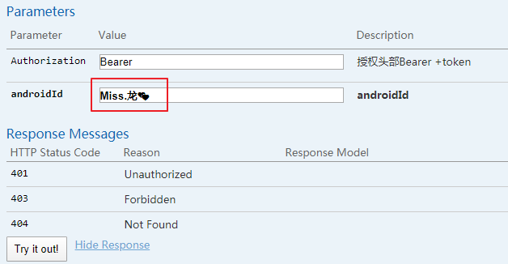

# mysql中emoji表情存储
##  背景

> 在mysql 5.7.19，创建的数据库默认选择的编码是`utf8 -- UTF-8 Unicode`，因此字段默认的编码为`utf-8`，但在项目开发中存在一个需求：在某个字段中存储混有emoji表情的字符串，此时以普通编码格式如`utf8`来存储emoji表情时，会报
```
org.springframework.orm.jpa.JpaSystemException: could not execute statement; nested exception is org.hibernate.exception.GenericJDBCException: could not execute statement
...

Caused by: org.hibernate.exception.GenericJDBCException: could not execute statement
...

Caused by: java.sql.SQLException: Incorrect string value: '\xF0\x9F\x92\x95\xE2\x80...' for column 'android_id' at row 1
```
- 请求的实例
<br/>
 

## 解决方案
1. 把`android_id`这个字段的编码格式改为：`utf8mb4`，如在Navicat中修改：
 

2.  修改mysql的配置
  > Windows下：在my.ini配置文件的`[mysqld]`下面添加：`character_set_server=utf8mb4`
3. 重启mysql服务
  > 在服务中找到mysql，点击重启

以上三步操作后就可以愉快的存储emoji表情啦。

## 小结
utf8与utf8mb4的区别：
- UTF-8编码中，一个英文字符占用一个字节的存储空间，一个中文（含繁体）占用三个字节的存储空间。
- UTF8MB4：MySQL在5.5.3之后增加了utf8mb4的编码，mb4就是most bytes 4的意思，专门用来兼容四字节的unicode。因此可以用来存储emoji表情。

## 拓展
- 当同时对编码类型为`utf8`的`validated`字段 和`utf8mb4`的`android_id` 字段联合查询时

在spring data jpa中查询会报该异常
```
 List<Toilet> findByAndroidIdAndValidated(String androidId, boolean flag);
```
异常如下
```
Caused by: java.sql.SQLException: Illegal mix of collations (utf8mb4_general_ci,IMPLICIT) and (utf8_general_ci,COERCIBLE) for operation '='
```
而在Navicat中使用sql查询并不会报错
```
SELECT * FROM `toilet` where android_id = 'Miss.龙💕' and validated = 1;
```
此时在my.ini配置文件的`[mysqld]`下面添加：`character_set_server=utf8mb4`，重启mysql，应该就可以解决了。


