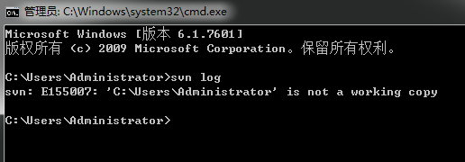
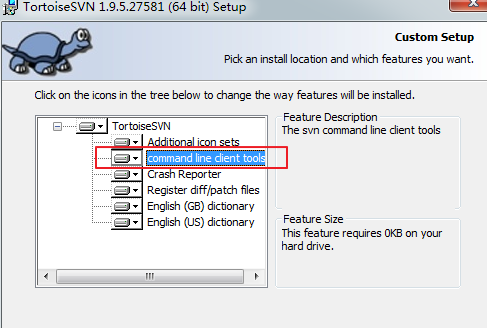
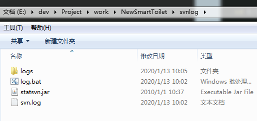
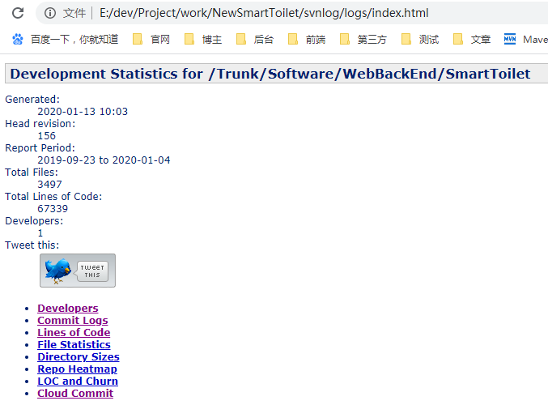

# svn代码量统计
## 背景
> 2019年年终总结，作为后端开发人员一整年的工作成果，最拿得出手的就是项目中的代码提交量，而在我的工作中，代码版本管理使用的是svn，但svn本身貌似不支持进行代码统计，因此从网上找到了一个svn代码统计的工具：StatSVN，该工具是由java写的一个jar包：`statsvn.jar`，因此要使用该工具前，==请确保安装了jdk环境==。

## 开始使用
### 下载statsvn.jar工具
 官网下载地址：http://www.statsvn.org/downloads.html
> 官网目前最新版本是`0.7.0`

> 本人点击时是无法下载的，因此这里提供另外一个下载地址：https://sourceforge.net/projects/statsvn/

###  确保svn支持命令行功能
 -  在命令行工具输入：`svn log`
 > 出现下面的情况，说明svn是支持命令行工具的，如果提示的是：`‘svn’不是内部或外部命令...`，则需要重装svn

  
 
 - 重装svn
 > 注意勾选上支持命令行工具

 

### 创建文件与目录
- 这里在`E:\dev\Project\work\NewSmartToilet\svnlog\`下新建一个`svn.log`文件和`logs`文件夹，并把刚刚下载的`statsvn.jar`包也放在当前目录下。
- `logs`目录用于存放最终生成统计的页面。

### 准备命令
 >  准备用于生成日志文件和页面的两个重要命令：生成`svn.log`文件和生成页面，这里直接把命令放在`bat`处理文件中，在`E:\dev\Project\work\NewSmartToilet\svnlog\`目录下新建一个`log.bat文`件，并放入以下命令
```bash
cd E:\dev\Project\work\NewSmartToilet\SmartToilet

svn log -r {2019-01-01}:{2019-12-31} --xml -v > E:\dev\Project\work\NewSmartToilet\svnlog\svn.log

cd E:\dev\Project\work\NewSmartToilet\svnlog

java -jar statsvn.jar E:\dev\Project\work\NewSmartToilet\svnlog\svn.log  E:\dev\Project\work\NewSmartToilet\SmartToilet -output-dir E:\dev\Project\work\NewSmartToilet\svnlog\logs
pause
```
说明
- 第一行表示进入到从svn checkout下来的项目目录：`cd {项目路径}`，这里checkout下来的项目为`SmartToilet`。
- 第二行表示生成log文件：`svn -log -r {提交代码的开始日期}:{提交代码的结束日期} --xml -v > 生成的日志文件路径`，这里生成的日志文件为`svn.log`。
- 第三行进入到存放statsvn.jar的目录：`cd {存放statsvn.jar的目录}`
- 第四行执行使用java命令生成文件：`java -jar statsvn.jar {上一步生成的日志文件路径} {从svn checkout下来的项目目录} -output-dir {最终生成的页面存放的目录}`。

### 结构目录
- 最终结构目录如下


### 生成分析页面
- 双击`log.bat`处理文件，等待执行。
- 生成页面后，点击进入`logs`目录，找到入口文件：`index.html`，点击查看。
- 最后生成的页面如下


> 到目前为止`3千`多个文件，`6万`多行代码，嗯。。。

完结，撒花。。。
